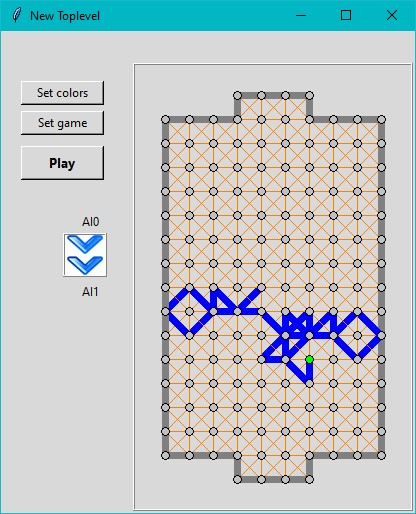
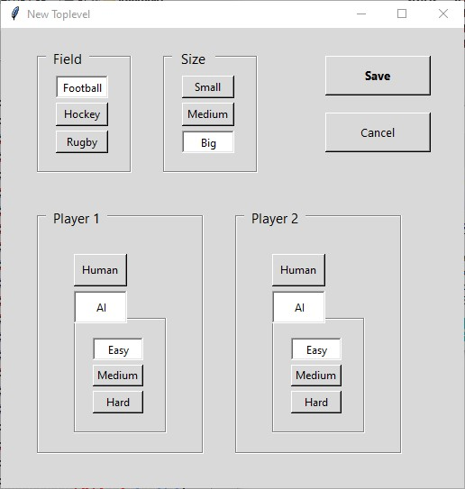

# Fotbal (Hokej) / Футбол (игра на бумаге) / Paper soccer 
Python version of traditional paper and pencil game, for more information go to [wikipedia](https://en.wikipedia.org/wiki/Paper_soccer).

GUI created with [PAGE](http://page.sourceforge.net).

### Main window


### Settings window



Game can be compiled with cx_freeze ```python setup.py build```.
